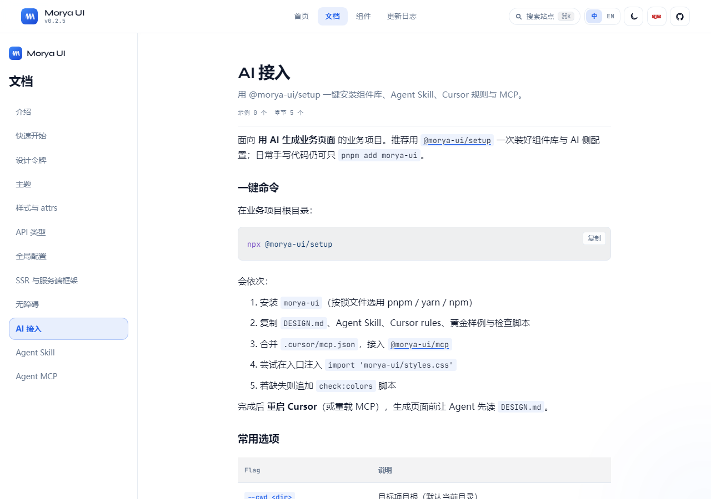
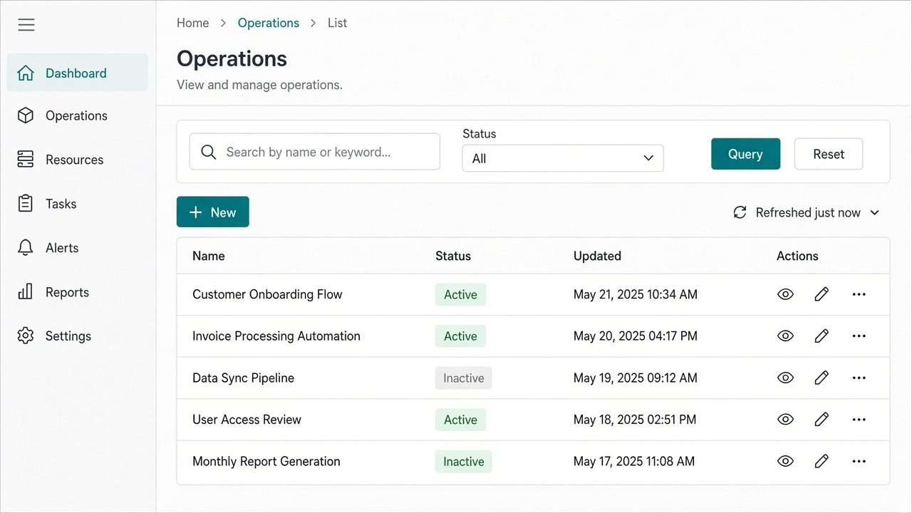

# 别手搓了，搓也搓不过 Agent


先说结论：后台列表这种活，我现在尽量不自己搓了。

不是因为我突然变懒（好吧，也有一点），是因为这活太「碎」。筛选对齐一下、表格列宽拧一下、空状态文案改两遍、暗色模式又漏一块色……单项都不难，串起来就像在调音：调完低音高音又歪了。

后来我想通一件事——**Agent 其实不笨，是我们喂得太随便**。你跟它说「用 Vue 写个用户列表」，它当然给你一堆 `div` + 自创 prop。换个思路：先把组件库、设计约定、黄金样例、能查文档的 MCP 塞进项目，再让它干活。人负责拍板，页面那层交给它。

库是开源的 Vue 3 组件库 [Morya UI](https://morya-space.github.io/morya-ui/)。文档站长这样：


接入就一句：

```bash
npx @morya-ui/setup
```

---

## 手搓到底输在哪

输的不是技术难度，是**没有复利**。

每个新后台我都重新发明一遍壳子：侧栏、顶栏、筛选、工具条、表格。第二次写的时候，上周的细节已经忘干净了。AI 也一样——你不给它图纸，它就现场发明图纸，发明完还挺自信。

更烦的一种情况是：组件库明明装了，Agent 不知道该用 `MPageFilters`，自己 `flex` 一把梭。你审代码的时候还得从「这是不是我们的组件」开始查，等于白装。

所以关键问题其实就一句：**AI 有没有同一份设计系统可以抄作业？**

---

## 先投喂，再让它写

业务项目根目录跑：

```bash
npx @morya-ui/setup
```

跑完大概会有这些变化（具体以你终端输出为准）：

1. 装上 `morya-ui`
2. 丢进来 `DESIGN.md`、Agent Skill（`morya-ui-pages`）、Cursor rules、黄金样例
3. 给 Cursor 写好 MCP（`@morya-ui/mcp`），生成的时候能查真实 Props / 示例
4. 尽量在入口帮你补上 `import 'morya-ui/styles.css'`
5. 顺手挂个裸色值检查脚本——谁再偷偷写 `#409EFF`，本地就能抓

官方 AI 接入页长这样，嫌我写得乱可以直接去文档站抄：



然后记得**重启 Cursor，或者至少重载一下 MCP**。生成页面前让 Agent 先读项目根目录的 `DESIGN.md`。别把它当「有空再看的 README」——那是第一信源。

文档：[AI 接入](https://morya-space.github.io/morya-ui/docs/ai-setup)

---

## 跟 Agent 说话，别太客气

装完之后我一般直接丢这种需求：

> 用 morya-ui 做一页用户管理列表：侧栏 + 面包屑 + 名称/状态筛选 + 表格 + 新建按钮。对齐黄金样例列表页，颜色只用 `--m-*`，不要臆造 prop。

语气随意一点也没关系，关键是把约束说死：用哪套库、对齐哪类样例、别瞎编 API。Skill 会把它钉到「Ops / 列表页」那条路上，优先看 `docs/golden-pages/list-page.vue`：`MLayout` 一套壳，`MPageContent` / `MPageFilters` / `MPageToolbar`，再加 `MTable`。

有 MCP 的时候更省心——它能按 `recommend_page` → `get_golden_page` → `get_component` 去查，而不是靠训练记忆赌一把。

Skill 说明：[Agent Skill](https://morya-space.github.io/morya-ui/docs/agent-skill)

---

## 出来大概长什么样

别期待它替你想清楚业务字段——那是你的活。但壳子、筛选、表格、操作列，它按规矩走的话，观感会接近这种列表页：



文档站里的 Table 预览也能对照——排序、筛选、分页这些，正是手搓最容易磨时间的地方：


手搓当然也能搓出同等效果。差别在第二次、第三十次：Agent 还在同一套契约上复用，你已经去对接口、改权限了。

---

## 几个实话，免得被锤

Agent 不是产品经理。字段叫啥、谁能看、接口长什么样，还是你说了算。

老项目跑 setup 时，默认**不会覆盖你已有文件**。要硬盖才加 `--force`；只想补 MCP、别的都跳过，文档里有 flags。

如果只是人手写页面，`pnpm add morya-ui` 完全够。setup 是给「打算让 AI 写页面」的人加速的，不是强制仪式。

还有一点：通用设计类 skill 可以当审美参考，但栈已经是 morya-ui 了，就以 `morya-ui-pages` 为准。不然又生成一页「挺好看、但和库完全不是一家」的后台，审起来更累。

---

## 收个尾

组件库负责有砖，Skill / rules / 黄金样例负责图纸，MCP 负责别记错型号。

人负责点头，改需求，偶尔骂两句再重跑。

页面那层——别手搓了，搓也搓不过 Agent。

<p align="center">
  
</p>

- 文档站：https://morya-space.github.io/morya-ui/
- GitHub：https://github.com/morya-space/morya-ui
- npm：`morya-ui` · `@morya-ui/setup` · `@morya-ui/mcp`
