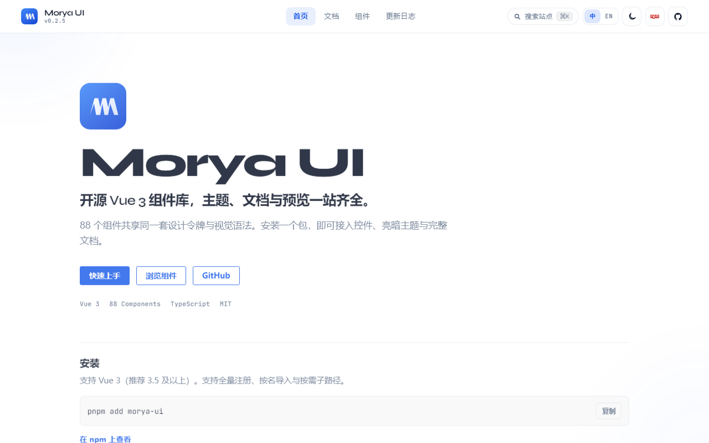
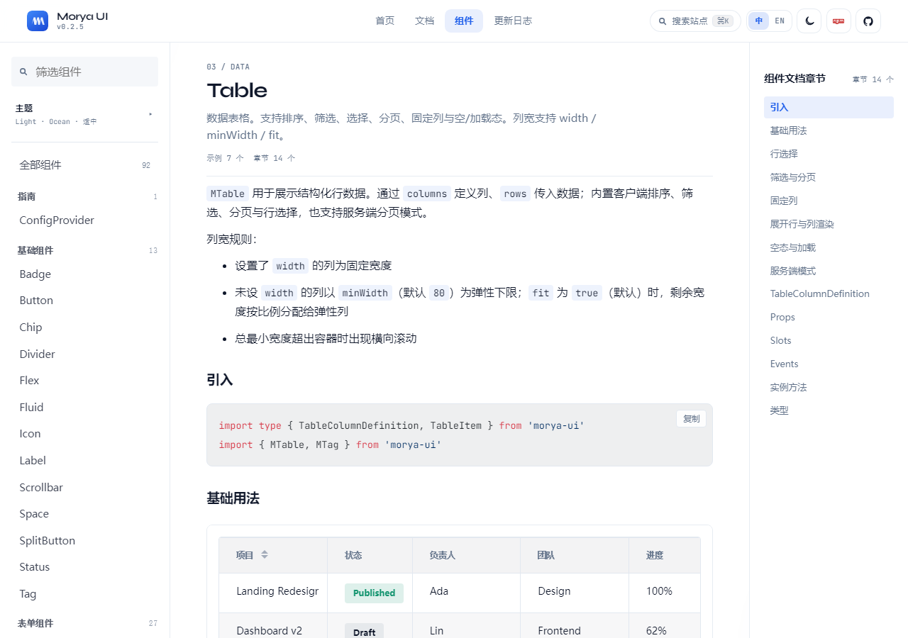

# 别手搓了，搓也搓不过 Agent
---
highlight: androidstudio
theme: fancy
---


上周接了个新后台。需求很简单：一个用户列表，带筛选、带分页、能新建。

我盯着空文件看了半分钟，脑子里开始过那些写过一百遍的东西：侧栏怎么收折、顶栏放什么、筛选区一行摆几个、表格列宽怎么分、空状态写什么文案、暗色模式下那个灰色会不会太浅……

然后我关了编辑器，去跟 Agent 说了句话。

十分钟后页面出来了。我花了二十分钟改字段名和权限逻辑。

说实话，有点不爽。但确实省了两小时。

## 问题不在 AI

组件库装了，AI 还是不用。它会自己写一堆 `div`，套上自创的 prop，跑起来没报错，看着还挺像那么回事。

你审代码的时候就得从头查一遍：这玩意儿是不是我们的组件？这个属性库里有吗？为什么这里又手写了一个 flex？

最后往往是把它的代码删了大半，自己重写。那装组件库图什么？

后来我想明白了：**不是它笨，是我没给它图纸。**

我说"用 Vue 写个用户列表"，这句话里没有任何关于设计系统的信息。它只能靠训练记忆赌一把，赌输了还特别自信。

所以真正该做的只有一件事：让 AI 有同一份东西可以抄。

## 我现在怎么弄

项目根目录跑一句：

```bash
npx @morya-ui/setup
```

这是 Morya UI 的 setup 脚本，一个开源的 Vue 3 组件库。文档站长这样：



跑完大概会干这几件事：

装上 `morya-ui`；往项目里塞 `DESIGN.md`、Agent Skill（`morya-ui-pages`）、Cursor rules 和黄金样例；给 Cursor 配好 MCP（`@morya-ui/mcp`），让它生成代码的时候能查到真实的 props 和示例；尽量在入口帮你补上 `import 'morya-ui/styles.css'`；再挂一个裸色值检查脚本——谁偷偷写 `#409EFF`，本地直接抓出来。

（具体以你终端输出为准，版本会变。）

官方 AI 接入页长这样，嫌我写得乱可以直接去文档站抄：


然后**重启 Cursor，或者至少重载一下 MCP**。这一步我忘了两次，白折腾半小时。

生成页面前，让 Agent 先读根目录的 `DESIGN.md`。别把它当"有空再看的 README"——那是第一信源。

文档：<https://morya-space.github.io/morya-ui/docs/ai-setup>

## 提示词别客气

我现在基本就这么丢：

> 用 morya-ui 做一页用户管理列表：侧栏 + 面包屑 + 名称/状态筛选 + 表格 + 新建按钮。对齐黄金样例列表页，颜色只用 `--m-*`，不要臆造 prop。

语气随意，约束要死。用哪个库、对齐哪个样例、不许编 API——这三句说清楚，出来的东西基本就在轨道上了。Skill 会把它钉到 Ops / 列表页那条路上，优先看 `docs/golden-pages/list-page.vue`：`MLayout` 一套壳，`MPageContent` / `MPageFilters` / `MPageToolbar`，再加 `MTable`。

有 MCP 的话更稳，它会按 `recommend_page` → `get_golden_page` → `get_component` 一路去查，而不是靠训练记忆赌一把。

Skill 说明：<https://morya-space.github.io/morya-ui/docs/agent-skill>

## 效果

别期待它替你想清楚业务字段——那是你的活。但壳子、筛选、表格、操作列，它按规矩走的话，观感会接近这种列表页：


文档站里的 Table 预览也能对照——排序、筛选、分页这些，正是手搓最耗时间的部分：



手搓当然搓得出来，效果一样。差别在第三十次：Agent 还在同一套契约上复用，我已经去对接口了。

## 几句实话

Agent 不是产品经理。字段叫什么、谁能看、接口长什么样，还是你定。

老项目跑 setup，默认**不会覆盖你已有文件**。想硬盖才加 `--force`；只想补 MCP、别的都跳过，文档里有 flags。

如果你不打算让 AI 写页面，`pnpm add morya-ui` 完全够。setup 是给"想让 AI 干活"的人加速的，不是仪式，不必搞。

通用设计类 skill 当审美参考行，但栈已经是 morya-ui 了，就以 `morya-ui-pages` 为准。不然又会多出一页"挺好看、但和库完全不是一家"的后台，审起来更累。这条我踩过。

## 就这样

砖是组件库的，图纸是 Skill 和黄金样例的，型号是 MCP 帮忙记的。

我负责点头，改需求，偶尔骂两句再重跑。

页面那层——搓不过就别搓了。

系列下一篇（组件库更完整的介绍）：[开源 Vue 3 组件库 Morya UI](../introducing-morya-ui/article.md)

*   文档站：<https://morya-space.github.io/morya-ui/>
*   GitHub：<https://github.com/morya-space/morya-ui>
*   npm：`morya-ui` · `@morya-ui/setup` · `@morya-ui/mcp`
