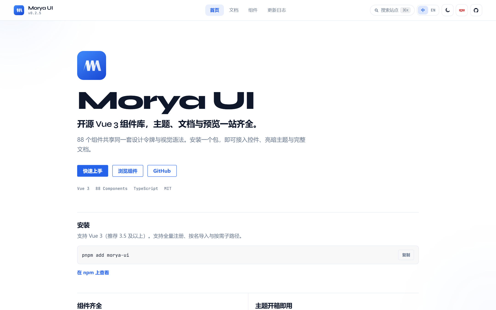
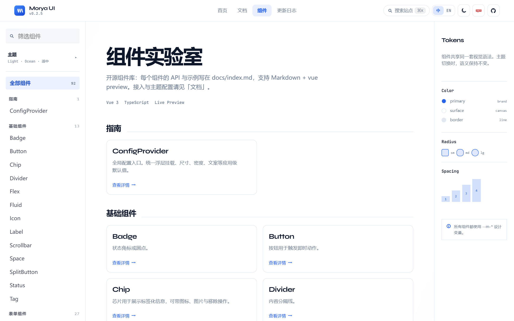
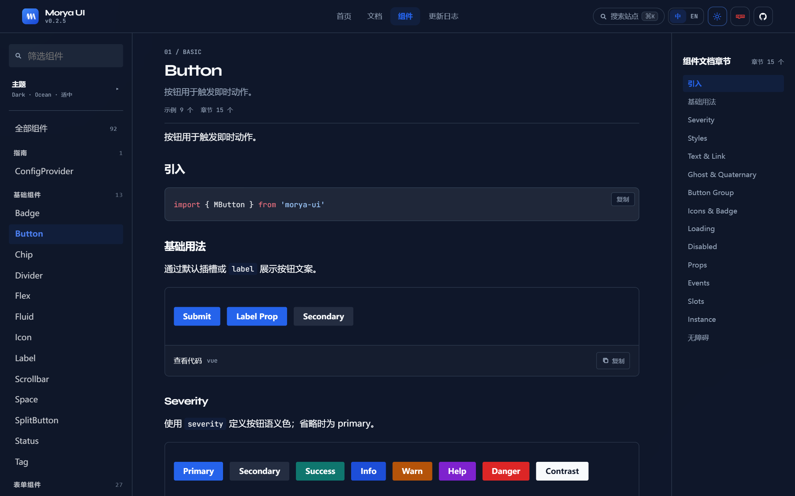
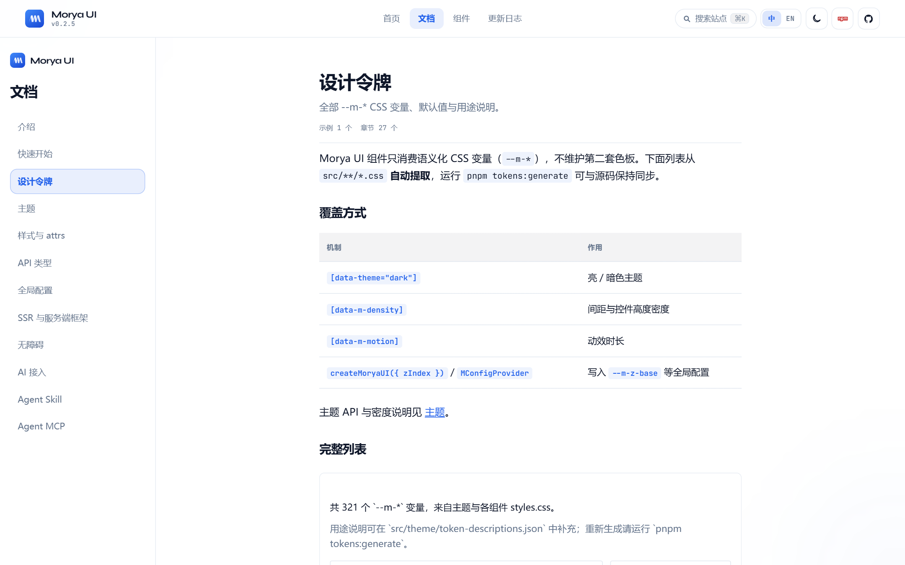
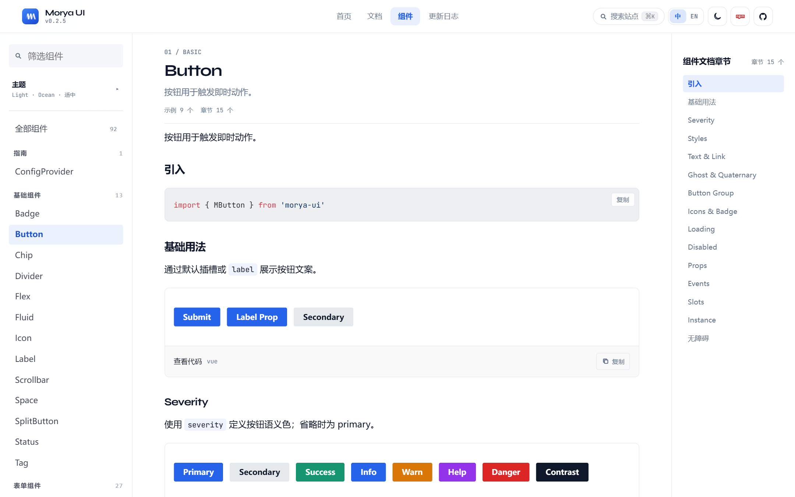
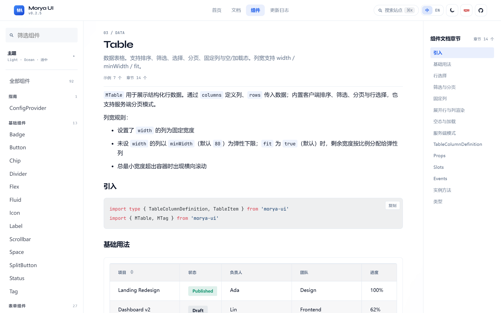
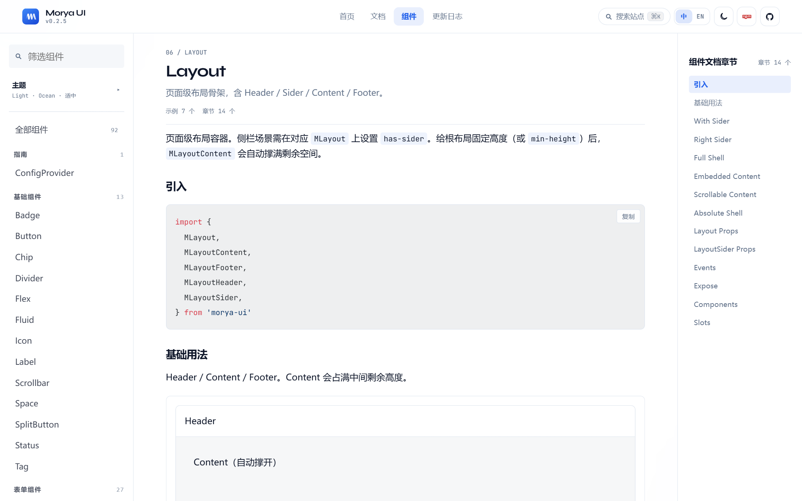
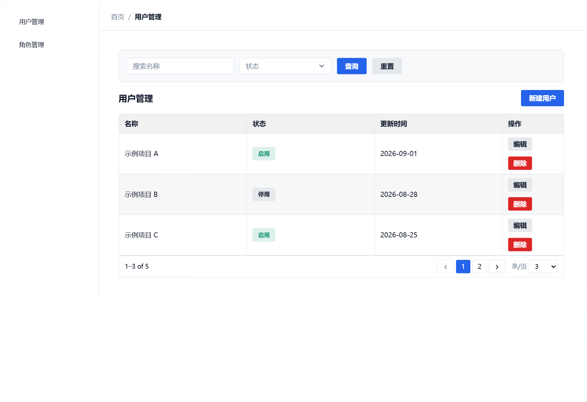
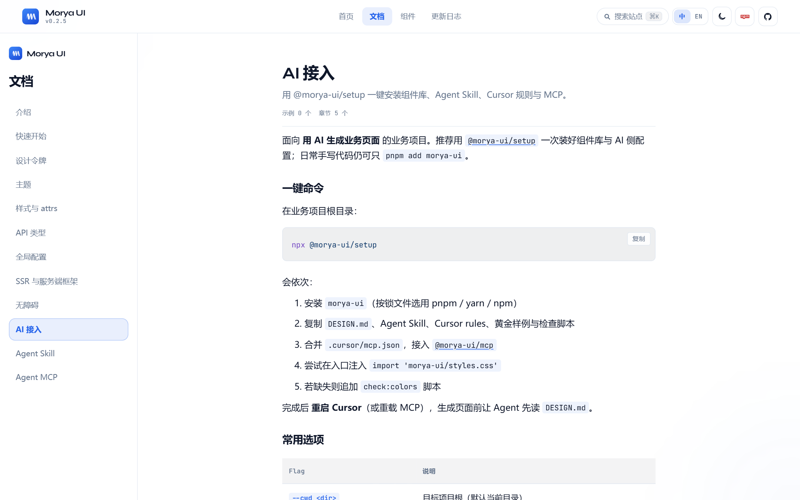

# 开源 Vue 3 组件库 Morya UI：从设计令牌到 AI 可生成页面



如果你最近在做 Vue 3 管理后台或 SaaS 控制台，大概率踩过这几件事：

- Element Plus / Ant Design Vue / Naive 都很成熟，但业务页一旦堆起来，**视觉和交互还是容易漂**——同一套库，两个同事写出来像两个产品。
- 主题切换、密度、浮层层叠、空状态文案……这些「不是业务却天天写」的东西，耗掉不少时间。
- 现在团队开始用 Cursor / Agent 写页面了，结果它更爱手搓 `div`，**装了组件库也不用**，审代码比自己写还累。

**Morya UI**（npm：`morya-ui`）就是冲着这些问题做的一套开源 Vue 3 组件库：组件齐全、主题靠 `--m-*` 令牌、文档可交互预览，并且可选地把 Skill / MCP / 黄金样例一起塞进业务项目，让人和 AI 用同一套契约。

- 文档站：<https://morya-space.github.io/morya-ui/>
- GitHub：<https://github.com/morya-space/morya-ui>
- 许可证：MIT


> 配图来自本地文档站截图（`pnpm dev` → `capture_screenshots.py`）。发掘金等平台时上传同目录 PNG 即可。上一篇：[别手搓了，搓也搓不过 Agent](../dont-handcraft-agent-wins/article.md)。

---

## 它是什么、适合谁

一句话：**给 Vue 3 中大型应用用的开源组件库**，自带设计令牌、亮暗主题、国际化，以及带 live preview 的文档站。

公开文档里写的是 **88 个组件**，覆盖基础控件、表单、导航、数据展示、布局和反馈。适合：

| 场景 | 为什么合适 |
| --- | --- |
| 管理后台 / 运营平台 | Layout、Page、Table、筛选区、Dialog 一条龙 |
| SaaS 控制台 | 主题、密度、浮层、表单校验开箱可用 |
| 内部工具 | 快速铺页面，视觉不靠个人发挥 |
| 想让 AI 写页面 | setup + Skill + MCP，减少「臆造 prop」 |

不太适合硬拿来当「纯营销落地页设计系统」——那类页面更吃品牌定制；Morya 的主场是 **Ops / 产品后台那条线**。



---

## 和「又一个组件库」差在哪

组件数量本身不是壁垒。Morya 想强调的是这几层叠在一起：

1. **令牌驱动外观**：组件吃 `--m-*`，不各自维护色板。
2. **接入方式灵活**：全量 / 按名 / 子路径按需 / Resolver，同一应用选一种即可。
3. **文档即预览**：Markdown + 可交互示例，查 API 和抄写法同一处。
4. **SSR 友好**：Nuxt 模块、Astro / Vite SSR 有指南。
5. **可选 AI 流水线**：`@morya-ui/setup`、`@morya-ui/mcp`、黄金样例页——不是营销口号，是可跑的包。

下面按「人怎么用」展开。

---

## 五分钟跑起来

需要 Vue 3（推荐 3.5+），以及能解析 package `exports` 的构建工具（Vite、webpack 5+ 等）。

```bash
pnpm add morya-ui
# npm i morya-ui
```

### 全量注册（上手最快）

```ts
import MoryaUI from 'morya-ui'
import { createApp } from 'vue'
import App from './App.vue'
import 'morya-ui/styles.css'

createApp(App).use(MoryaUI).mount('#app')
```

模板里直接写 `<MButton>`、`<MInput>`。

### 按需子路径（体积敏感）

```ts
import { MButton } from 'morya-ui/button'
import { MInput } from 'morya-ui/input'
```

子路径会自动带上主题与依赖样式，不必再手动拼一堆 CSS。

### 应用级默认（语言、尺寸等）

```ts
import { createMoryaUI, zhCN } from 'morya-ui'

createApp(App).use(createMoryaUI({ locale: zhCN })).mount('#app')
```

子树覆盖用 `<MConfigProvider>`。完整对照见文档：[快速上手](https://morya-space.github.io/morya-ui/docs/quick-start)。

---

## 主题：亮暗、密度、动效都是一等公民

引入 `morya-ui/styles.css` 后，语义变量已经就位。组件不写死 `#409EFF` 这种裸色值，而是吃令牌：

| Token | 用途 |
| --- | --- |
| `--m-color-primary` | 品牌主色 |
| `--m-color-surface` | 页面底色 |
| `--m-color-text` | 正文 |
| `--m-color-border` | 分割线 / 描边 |
| `--m-radius-*` / `--m-space-*` | 圆角与间距阶梯 |
| `--m-z-overlay` 等 | 浮层层叠 |

切换亮暗：

```ts
import { useTheme } from 'morya-ui'

const { isDark, setTheme, toggleTheme } = useTheme()
toggleTheme() // 写到 documentElement 的 data-theme
```

密度与动效同包导出：

```ts
import { useDensity, useMotion } from 'morya-ui'

useDensity().setDensity('compact') // compact | comfortable | spacious
useMotion().setMotion('reduced')   // full | reduced | none
```

文档站右上角的主题按钮，用的就是同一套 API。完整令牌列表：[设计令牌](https://morya-space.github.io/morya-ui/docs/design-tokens) · [主题](https://morya-space.github.io/morya-ui/docs/theme)。





业务项目里如果怕有人偷偷写裸色值，setup 脚本还可以挂一个 `check:colors`——本地直接抓 `#xxx`。这不是吹，是真的会省 code review 里「这灰是哪来的」那种扯皮。

---

## 组件面：后台需要的基本都有

按职责粗分（名字以文档站为准）：

| 类别 | 例子 |
| --- | --- |
| 基础 | Button、Icon、Tag、Divider、Space、Flex、Grid |
| 表单 | Input、Select、DatePicker、Checkbox、Switch、Form、Upload… |
| 数据 | Table、Tree、TreeTable、Pagination、DataView、Empty、Result |
| 导航 | Menu、Menubar、Tabs、Breadcrumb、Steps（Stepper）、Sidebar |
| 浮层 | Dialog、Drawer、Popover、Dropdown、Toast、Confirm* |
| 布局 | Layout、Page、Splitter、Panel、Toolbar |

文档站每个组件页都是 **Markdown + 可点可改的 preview**，不是纯静态截图：





做列表页时，最耗时间的往往不是「会不会写表格」，而是排序、筛选、分页、空状态、操作列和外壳怎么凑齐。Morya 把这些拆成稳定积木，再配 `MPageContent` / `MPageFilters` / `MPageToolbar` 一类页面层组件，后台骨架会短很多。



---

## 搭一页「像样」的后台列表长什么样

不必从零拼侧栏。黄金样例里有列表 / 表单 / 仪表盘 / 登录等模板（setup 会拷进业务仓库的 `docs/golden-pages/`）。列表页大致是：

- `MLayout` 管壳（侧栏 + 顶栏 + 内容区）
- `MPage*` 管页内结构（标题、筛选、工具条）
- `MTable` 管数据
- 颜色只用 `--m-*`，不臆造不存在的 prop

跑起来的观感接近：



手写时打开文档站抄 preview；让 Agent 写时，提示词里钉死「对齐黄金样例 + 不要臆造 API」，成功率会高一个数量级。这点和上一篇是同一条结论，这里只强调：**组件库提供的是契约，不是一堆长得像的组件名。**

---

## 生态：四个包各管一段

| 包 | 干什么 |
| --- | --- |
| [`morya-ui`](https://www.npmjs.com/package/morya-ui) | 组件、样式、主题、locale |
| [`@morya-ui/nuxt`](https://www.npmjs.com/package/@morya-ui/nuxt) | Nuxt 3 模块（样式、transpile、overlay） |
| [`@morya-ui/mcp`](https://www.npmjs.com/package/@morya-ui/mcp) | 可选 MCP：给 AI 查真实 props / 示例 |
| [`@morya-ui/setup`](https://www.npmjs.com/package/@morya-ui/setup) | 一键装库 + DESIGN.md + Skill + rules + MCP |

只想当普通组件库用：

```bash
pnpm add morya-ui
```

想让 Cursor / Agent 按库的规矩生成页面：

```bash
npx @morya-ui/setup
```

默认**不覆盖**你已有文件；需要硬盖才加 `--force`。装完记得重启 Cursor 或重载 MCP。细节：[AI 接入](https://morya-space.github.io/morya-ui/docs/ai-setup)。



---

## TypeScript、按需与 SSR（工程向）

- **TS 优先**：Composition API 编写，Props / Emits / locale 有完整类型，编辑器补全是可用的。
- **Resolver**：可配合 `unplugin-vue-components` 的 `MoryaUIResolver`，少写一堆 import。
- **SSR**：Nuxt / Astro + Vue / Vite SSR 有专门指南；Nuxt 用 `@morya-ui/nuxt` 少踩 hydrate / 浮层挂载的坑。见 [SSR](https://morya-space.github.io/morya-ui/docs/ssr)。
- **样式与 attrs**：fallthrough、`pt`、事件落点有统一约定，见 [样式与 attrs](https://morya-space.github.io/morya-ui/docs/attrs)。

这些是「能不能安心进生产」的细节。组件库如果只晒组件截图、不交代打包和 SSR，上线那周就会还债。

---

## 本地开发与贡献

仓库本身是 monorepo 风格的组件库工程：

```bash
pnpm install
pnpm dev              # 文档站，默认 http://localhost:5182
pnpm build            # 打出 dist/
pnpm test
pnpm typecheck
```

文档站通过 Vite alias 直连 `src/`，改组件即时可见。欢迎 Issue / PR，中文贡献指南：[CONTRIBUTING.zh-CN.md](https://github.com/morya-space/morya-ui/blob/main/CONTRIBUTING.zh-CN.md)。

---

## 什么时候选它、什么时候别硬选

**可以认真考虑：**

- 新开或重构 Vue 3 后台，希望主题和页面骨架统一
- 团队开始用 AI 写页面，需要可检索的组件契约
- 需要亮暗、密度、浮层、i18n，又不想自己维护第二套设计系统

**需要想清楚：**

- 已有深度定制的 Element / AntD 主题与业务组件海——迁移成本是真实的，不必为了「新」而迁
- 强品牌营销站、高度异形动效——更适合专用设计实现，组件库只作局部控件
- 纯 React / 小程序栈——这是 Vue 3 库

开源项目还在演进，API 以文档站与 npm 版本为准；遇到问题直接提 Issue 通常比在评论区猜更快。

---

## 小结

Morya UI 想交付的不只是「88 个好看的组件」，而是：

1. **令牌化主题**——视觉可调、可检查、可统一  
2. **可交互文档**——人和 AI 都能抄到真东西  
3. **可选 AI 接入**——Skill / MCP / 黄金样例，把「用我们的组件」写进工作流  

如果你只是要按钮和表格，`pnpm add morya-ui` 就够。  
如果你已经烦透了 Agent 手搓后台，再跑一次 `npx @morya-ui/setup`。

* 文档站：<https://morya-space.github.io/morya-ui/>  
* GitHub：<https://github.com/morya-space/morya-ui>  
* npm：`morya-ui` · `@morya-ui/setup` · `@morya-ui/mcp` · `@morya-ui/nuxt`
