# 开源 Vue 3 组件库 Morya UI：主题、文档与 AI 一站式，再用它快速搭一套中后台


如果你做过 Vue 3 中后台，大概都经历过：组件够用但主题难统一、文档和真实 API 对不上、交给 AI 写页面却总「发明」不存在的 props。

**Morya UI**（npm：`morya-ui`）想解决的，就是把「组件 + 设计令牌 + 可交互文档 + AI 可检索知识」捆成一套能真正落地的工具链。本文结合官方文档站，以及用它快速做出来的演示项目 **morya-admin**，把特色讲清楚。

- 文档站：<https://morya-space.github.io/morya-ui/>
- GitHub：<https://github.com/morya-space/morya-ui>
- npm：[`morya-ui`](https://www.npmjs.com/package/morya-ui)
- 演示后台：<https://github.com/xcGoGo2/morya-admin>
- 许可证：MIT

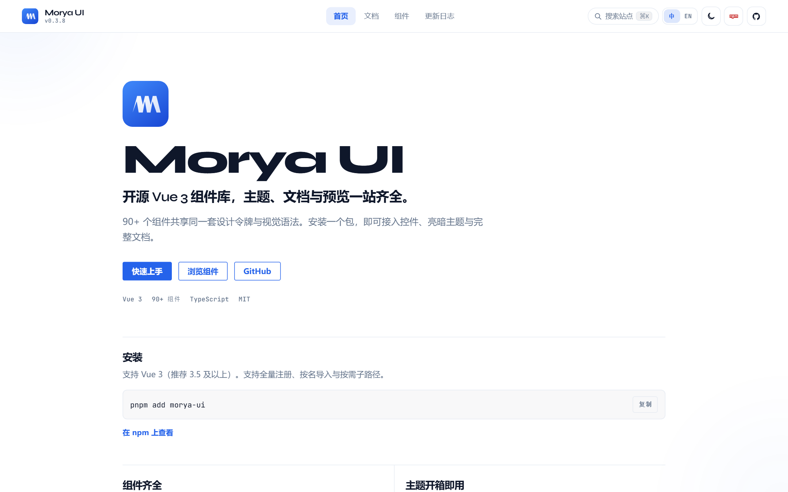

> 配图来自文档站与本地 `morya-admin` 截图；发掘金等平台时可上传同目录 PNG，或使用已传图床链接。上一篇：[别手搓了，搓也搓不过 Agent](../dont-handcraft-agent-wins/article.md)。

---

## 一、Morya UI 是什么？

**Morya UI** 是一套开源的 **Vue 3** 组件库，当前约 **v0.3.8**，组件数量 **90+**（文档侧统计约 92）。

一句话概括：

> 安装一个包，就能获得统一视觉语言的控件、亮暗主题与密度/动效控制，以及可在线预览的完整文档；若你用 Cursor / VS Code 等支持 MCP 的 AI 编辑器，还可以把官方文档「喂」给 Agent，按真实 API 生成页面。

| 场景 | 为什么合适 |
| --- | --- |
| 管理后台 / 运营平台 | Layout、Page、Table、筛选区、Dialog 一条龙 |
| SaaS 控制台 | 主题、密度、浮层、表单校验开箱可用 |
| 内部工具 | 快速铺页面，视觉不靠个人发挥 |
| 想让 AI 写页面 | setup + Skill + MCP，减少「臆造 prop」 |

不太适合硬拿来当「纯营销落地页设计系统」——那类页面更吃品牌定制；Morya 的主场是 **Ops / 产品后台那条线**。

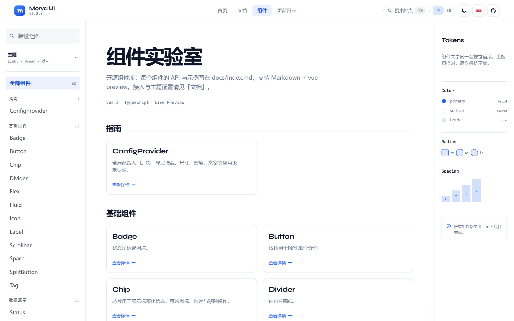

---

## 二、它和「又一个组件库」差在哪？

同类库很多。Morya UI 更值得关注的，是下面几条**成体系**的能力，而不是某一个单独的按钮样式。

### 1. 组件齐全，且按业务场景覆盖

基础、表单、导航、数据展示、布局、反馈都有。中后台最常用的布局壳、表格筛选、表单浮层、消息反馈等，不必东拼西凑多个库。

单个组件页是「说明 + 可交互预览 + API」一体，例如 Button 的 severity、样式变体都能直接点着看：

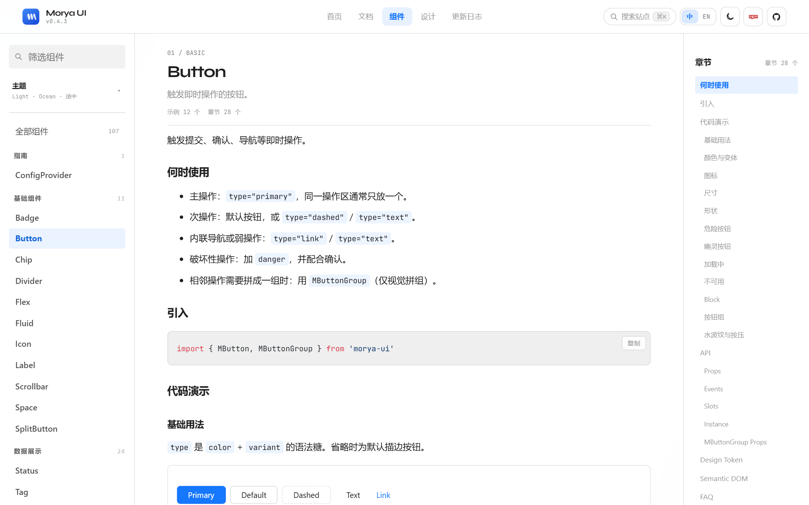

文档站还有 Table、Layout 等更重的组件页可对照：

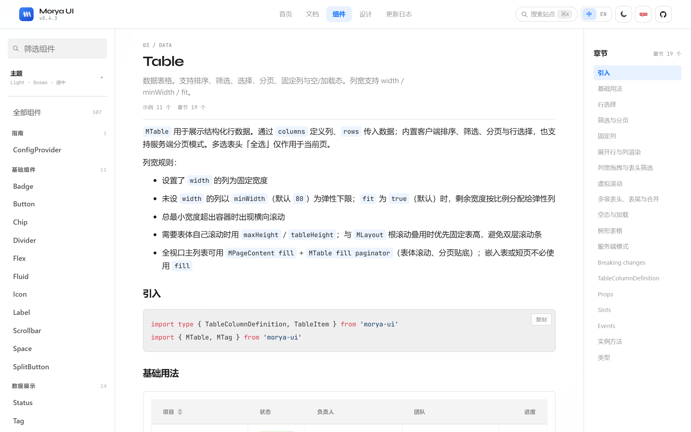

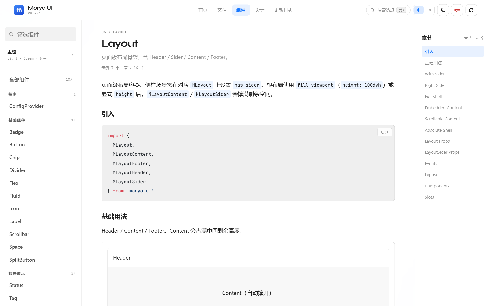

### 2. 设计令牌驱动的主题系统（`--m-*`）

颜色、间距、圆角等统一走 CSS 变量。亮 / 暗主题、密度（`useDensity`）、动效强度（`useMotion`）同包导出；局部可用 `MConfigProvider` 覆盖，品牌色优先改 `--m-color-primary` 一类 token，而不是到处写死 hex。

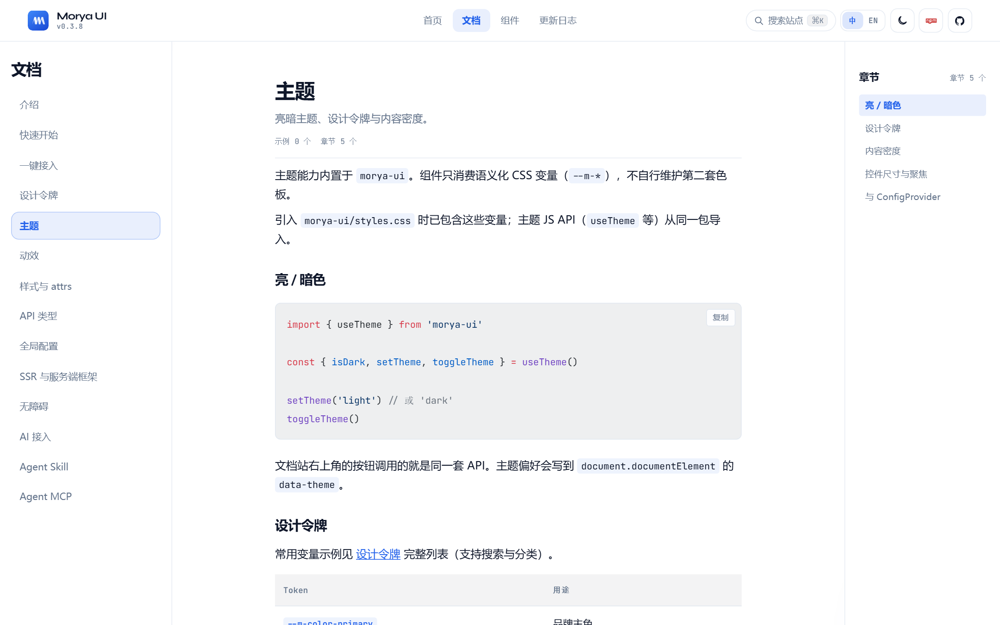

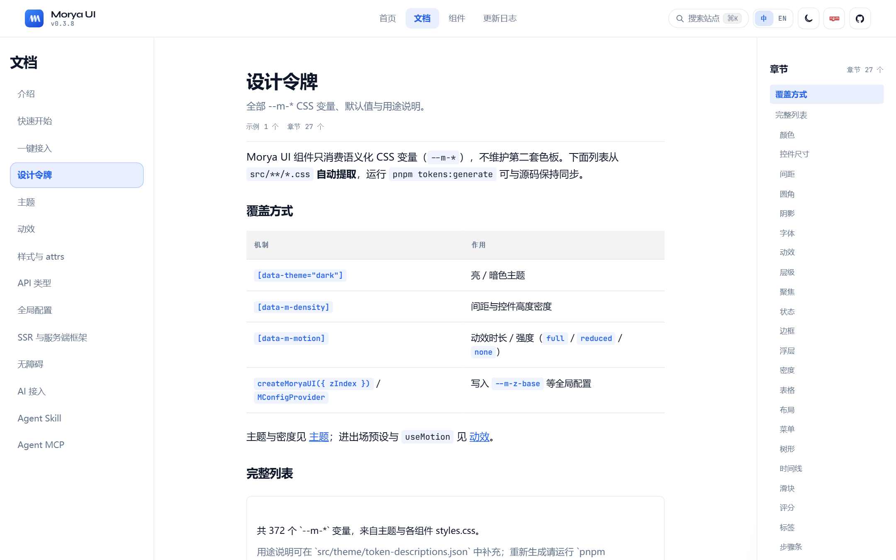

业务项目里还可以用配套的 `check:colors` 脚本拦截裸 hex/rgb，逼着团队吃设计系统，而不是「看起来差不多」。暗色模式下同一套组件也保持可读性：

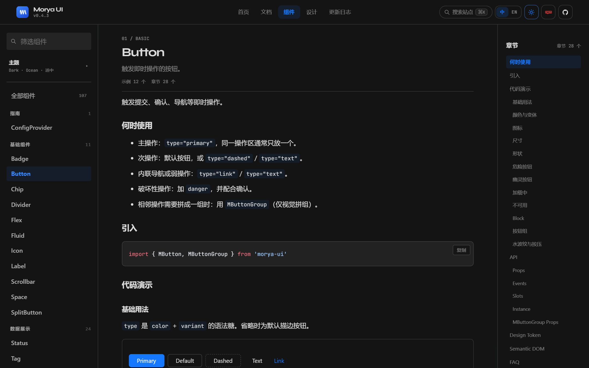

### 3. TypeScript 优先 + 多种接入方式

Composition API + 完整 Props / Emits / locale 类型。接入方式包括：

- 全量 `app.use(MoryaUI)`
- 具名导入
- 子路径按需（如 `morya-ui/button`）
- `unplugin-vue-components` + `MoryaUIResolver`

还提供 `@morya-ui/nuxt`，以及 Nuxt / Astro / Vite SSR 指南，适合不只做 SPA 的团队。

### 4. 「文档即预览」——文档站本身就是最好的样板间

每个组件自带 Markdown 与可交互 `vue preview`。文档站支持中英切换、⌘K 搜索、暗色模式，组件页还带章节目录，适合一边对照 API 一边抄写法。

### 5. AI 原生工具链：Skill + MCP + 一键 setup（差异化最大）

这是 Morya UI 很鲜明的特色：**不为 AI 包装一层口号，而是把「查真实文档 → 拼页面 → 校验用法」做成可执行协议。**

| 包 | 作用 |
| --- | --- |
| `morya-ui` | 组件、样式、主题、locale |
| `@morya-ui/mcp` | MCP 服务：组件 API、示例、页面配方、`validate_usage` / `validate_page` |
| `@morya-ui/setup` | 一键给业务项目装库、样式、`DESIGN.md`、Agent Skill、Cursor 规则、多编辑器 MCP |

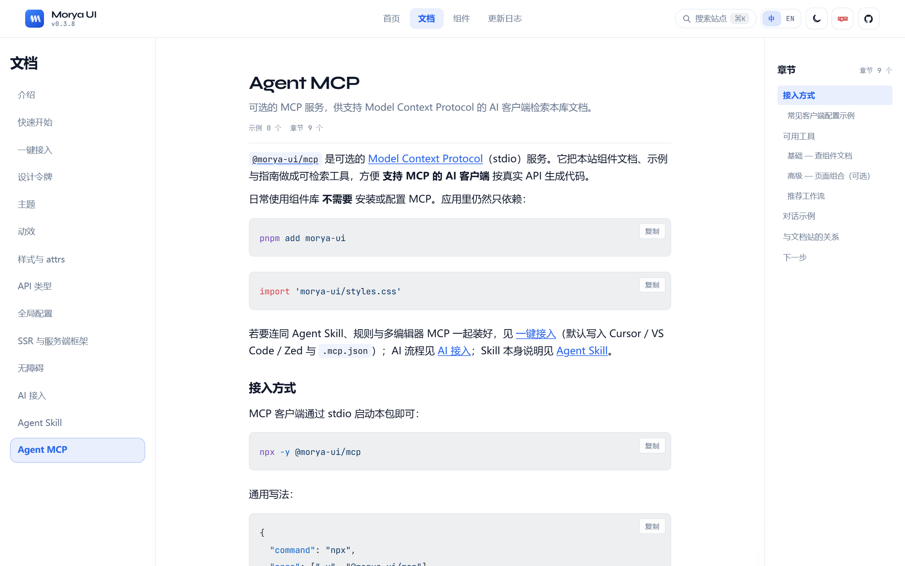

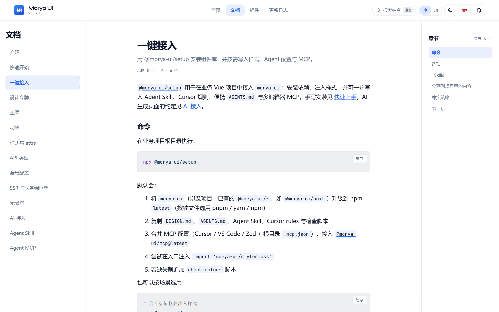

推荐工作流可以概括成：

1. `recommend_page` / `map_reference` 定页面结构
2. `get_page_snippet` 拿区块片段拼装
3. `get_component` / `get_example` 查真实 API（禁止瞎编 prop）
4. `validate_usage` + `validate_page` 做契约校验

对 Cursor 这类 Agent 友好编辑器来说，这相当于给组件库装了「官方知识库 + 质检闸」。黄金样例列表页也能直接对照块顺序：

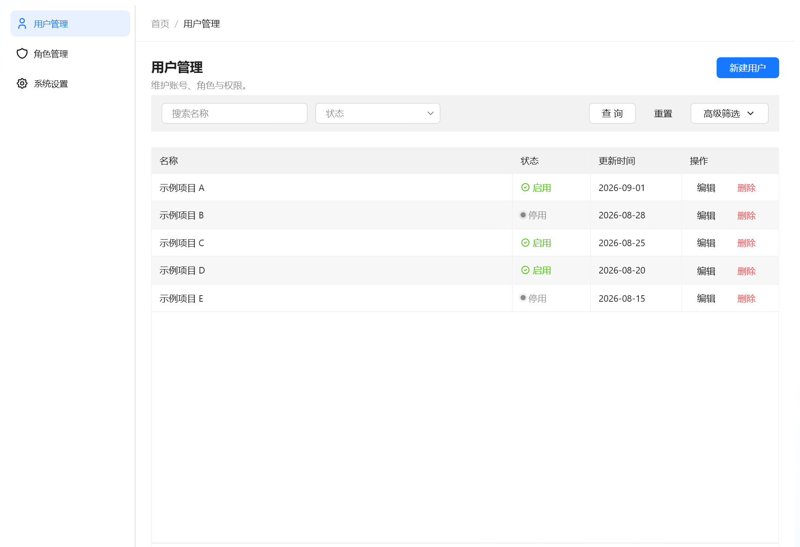

---

## 三、五分钟上手

需要 Vue 3（推荐 3.5+），以及能解析 package `exports` 的构建工具（Vite、webpack 5+ 等）。

```bash
pnpm add morya-ui
# npm i morya-ui
```

### 全量注册（上手最快）

```ts
import MoryaUI from 'morya-ui'
import { createApp } from 'vue'
import App from './App.vue'
import 'morya-ui/styles.css'

createApp(App).use(MoryaUI).mount('#app')
```

模板里直接写 `<MButton>`、`<MInput>`。

### 按需子路径（体积敏感）

```ts
import { MButton } from 'morya-ui/button'
import { MInput } from 'morya-ui/input'
```

子路径会自动带上主题与依赖样式。

### 应用级默认（语言、尺寸等）

```ts
import { createMoryaUI, zhCN } from 'morya-ui'

createApp(App).use(createMoryaUI({ locale: zhCN })).mount('#app')
```

若希望「装库 + AI 配置」一步到位，在业务项目根目录：

```bash
npx @morya-ui/setup
# 或只升级 AI / MCP：
npx @morya-ui/setup ai
```

更多细节见文档：[快速上手](https://morya-space.github.io/morya-ui/docs/quick-start)、[一键接入](https://morya-space.github.io/morya-ui/docs/setup)。

---

## 四、案例：用 Morya UI 快速做出的 morya-admin

光看组件还不够。**morya-admin** 是用 `morya-ui` 搭起来的中后台高保真演示：登录、工作台、系统管理（用户/角色/菜单/部门/字典/参数）、业务订单与商品、日志、异常页、主题与布局设置等，一套中后台骨架基本齐了。

仓库：<https://github.com/xcGoGo2/morya-admin>

技术栈很干净：`Vue 3 + Vite + TypeScript + Vue Router + morya-ui`，接口层是 mock，方便本地跑通体验。

### 1. 登录页：品牌区 + 表单组件落地

分栏登录、记住我、暗色切换，表单与按钮直接用库内组件，视觉和文档站同一套 token：

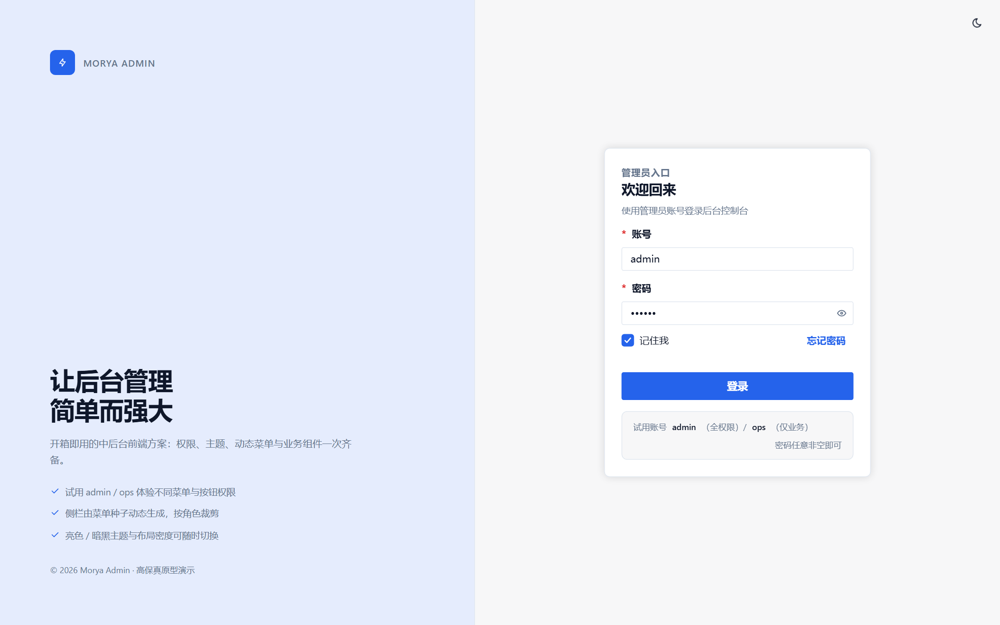

试用账号提示里写了：`admin` 全权限、`ops` 偏业务权限——任意非空密码即可登录，方便演示 RBAC。

### 2. 工作台：布局壳 + 统计卡 + 图表区 + 时间线

`MLayout` 一类布局、侧栏菜单、顶栏工具、多标签、统计指标、时间线等拼成完整 dashboard：

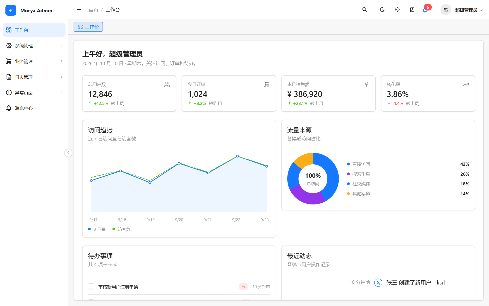

### 3. 列表页范式：筛选 + 工具栏 + 表格 + 分页

用户管理是典型 CRUD 列表：搜索、状态下拉、高级筛选、新建、行内编辑/删除、状态 Tag、分页器——中后台 80% 的页面都是这个形状：

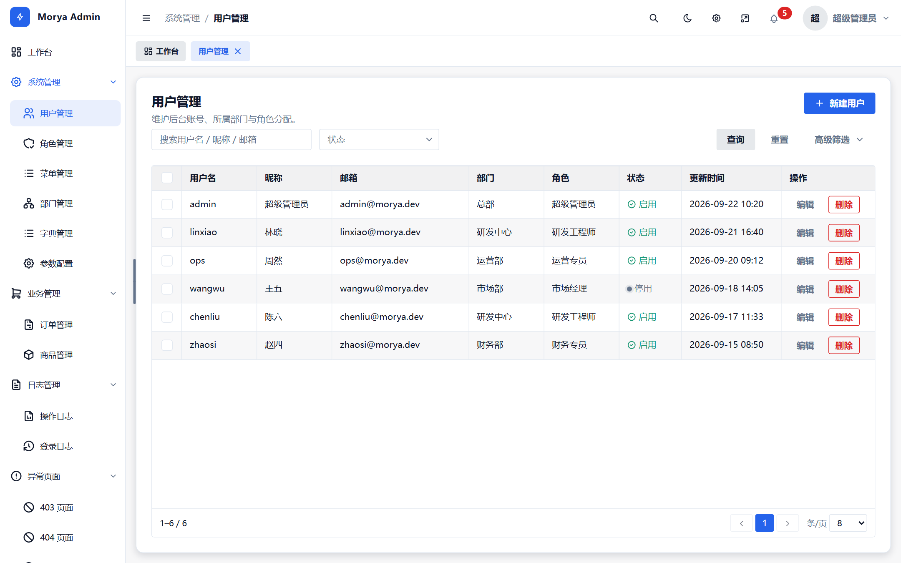

订单管理同样是业务列表范式，说明组件库不只适合「系统管理」页：

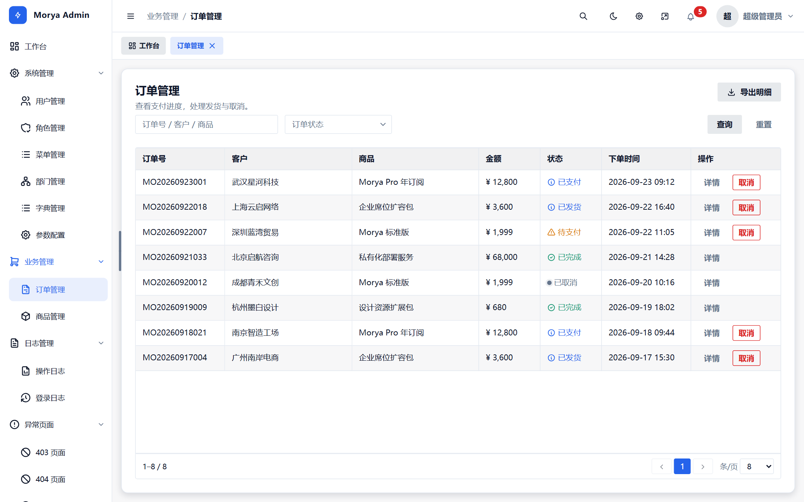

### 4. 布局与主题可调

顶栏可进布局设置，配合亮暗切换、密度等，体现「主题系统不是文档里的概念，是产品里的开关」：

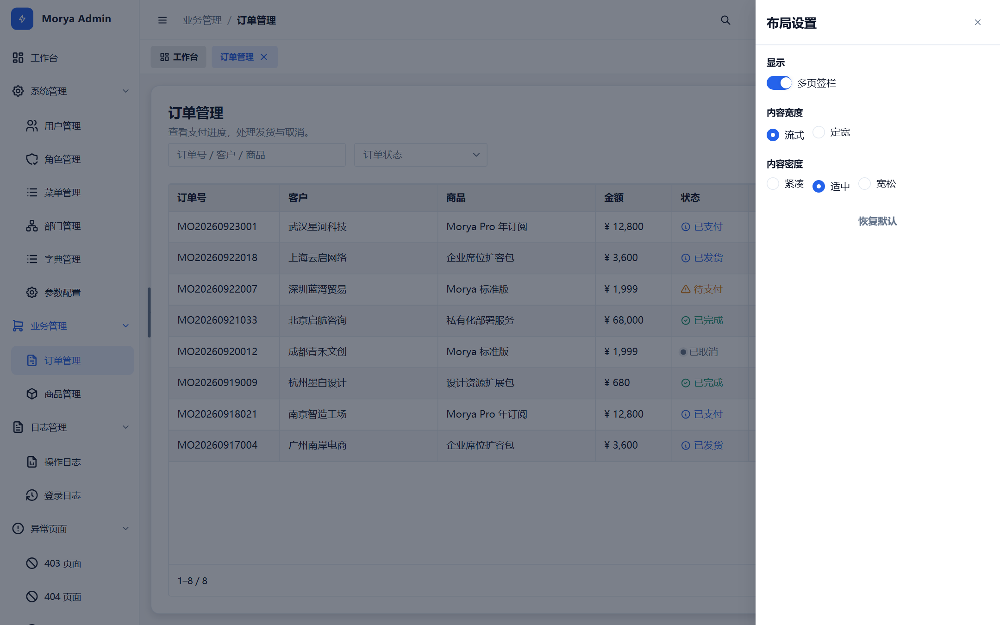

### 这个案例想证明什么？

1. **组件覆盖够**：登录、壳层、表单、表格、反馈、空/错页，不必再混搭另一套 UI。
2. **视觉一致**：`--m-*` token + 统一组件皮肤，后台不会「每一页一种风格」。
3. **开发路径短**：Vite 脚手架 + `morya-ui` 就能搭出可演示的中后台；若再接 `@morya-ui/setup` + MCP，列表/表单页可以用 Agent 按配方生成，再人工收口业务逻辑。
4. **可扩展**：权限指令、动态菜单、多 Tab 等是业务层能力，但交互表面仍落在 `M*` 组件上，后续换接口、接真实后端时 UI 层不用推倒重来。

---

## 五、适合谁用？不太适合谁？

**比较适合：**

- Vue 3 中后台、SaaS 控制台、内部运营平台
- 希望主题 / 密度 / 动效可控、禁止业务侧乱写色值的团队
- 已经在用 Cursor 等 AI 编码工具，希望组件库能「被 Agent 正确调用」的团队

**需要心里有数的：**

- 库仍在较快迭代（0.x），发版节奏跟得上即可，要锁版本就锁
- 图表类（如工作台折线/环图）通常仍需业务侧自绘或接图表库；Morya UI 负责控件与布局语言
- AI 工具链是加分项，不是门槛：日常只装 `morya-ui` 完全够用

---

## 六、小结

Morya UI 不只是「又一个 Vue 3 组件合集」，而是更接近一条**中后台前端生产线**：

- **组件层**：90+ `M*` 控件，ESM / 按需 / TS
- **设计层**：`--m-*` 令牌，亮暗、密度、动效同包
- **文档层**：可交互文档站，预览即真相
- **AI 层**：`@morya-ui/mcp` + Skill + `@morya-ui/setup`，让 Agent 查真实 API、拼页面、做校验
- **落地层**：morya-admin 证明用这套东西，可以很快拼出完整后台体验

如果你正在选 Vue 3 组件库，或者想给团队补一条「文档 + Agent 可复用」的工程化路径，不妨：

1. 打开 [文档站](https://morya-space.github.io/morya-ui/) 逛几页组件预览
2. clone [morya-admin](https://github.com/xcGoGo2/morya-admin) 本地 `pnpm i && pnpm dev` 点一遍
3. 在自己的业务仓跑一次 `npx @morya-ui/setup`，体验「装库 + AI 配置」

欢迎 Star、提 Issue，也欢迎直接拿 morya-admin 当脚手架骨架改造成自己的后台。

---

**参考链接**

- 文档站：https://morya-space.github.io/morya-ui/
- 组件库：https://github.com/morya-space/morya-ui
- npm：https://www.npmjs.com/package/morya-ui
- MCP：https://www.npmjs.com/package/@morya-ui/mcp
- Setup：https://www.npmjs.com/package/@morya-ui/setup
- morya-admin：https://github.com/xcGoGo2/morya-admin
